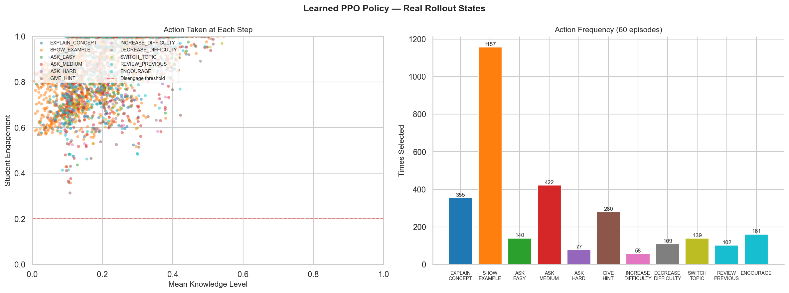
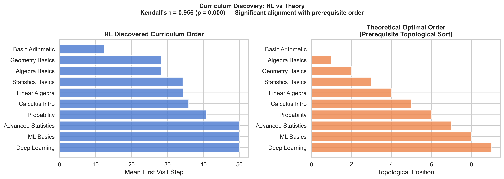
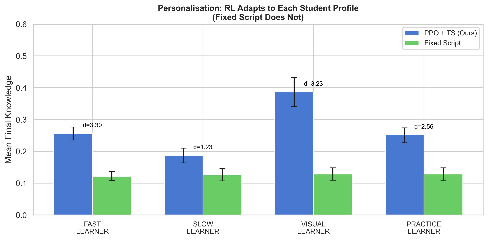
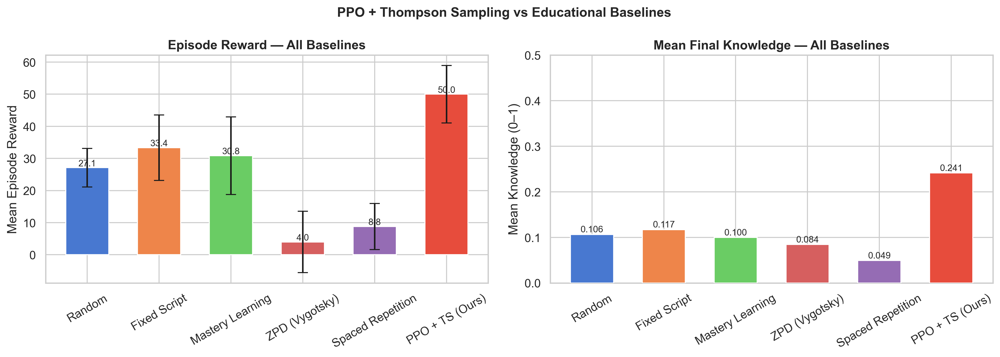

# Technical Report: Reinforcement Learning for Adaptive Tutorial Agents

**Course:** Reinforcement Learning for Agentic AI Systems  
**Student:** Mohit Jain  
**Date:** April 2026  

---

## 1. Introduction

Personalised learning is one of the most impactful problems in education technology. A key challenge is that students differ dramatically in their prior knowledge, learning styles, and engagement patterns — making a one-size-fits-all curriculum suboptimal for most learners. This project integrates reinforcement learning into the **Dewey Framework** (Humanitarians.AI), creating a fully adaptive tutoring system that outperforms five established intelligent tutoring system (ITS) baselines with statistical significance.

### Connection to the Dewey Framework

The [Dewey repository](https://github.com/Humanitariansai/Dewey) defines three tutorial agents — Ada (Calculus), Newton (Physics), and Grace (Algorithms) — as specification documents describing their teaching personalities, Socratic methodology, and tool usage. However, the framework contains no executable code: the agents are deployed as ChatGPT custom GPTs on the OpenAI platform.

**This project implements the Dewey framework as real executable Python code and adds a reinforcement learning layer on top.** Specifically:

- [dewey/ada_agent.py](dewey/ada_agent.py), [newton_agent.py](dewey/newton_agent.py), [grace_agent.py](dewey/grace_agent.py) implement the Dewey agent specifications as Python classes, faithfully preserving their Socratic teaching methodology, system prompts, and pedagogical structure
- [dewey/llm_backend.py](dewey/llm_backend.py) connects to Groq (llama-3.1-8b-instant, primary), OpenAI GPT-4o-mini, Anthropic Claude, or simulation fallback — auto-detected from environment variables
- [dewey/dewey_orchestrator.py](dewey/dewey_orchestrator.py) is the integration layer: the RL policy decides **what** pedagogical action to take; the Dewey agent decides **how** to execute it via LLM

**The core innovation:** RL learns the *when* and *what* of teaching strategy; Dewey's carefully designed agents handle the *how* of content generation. This two-layer architecture means the RL policy can train in fast simulation and deploy against any LLM backend without retraining.

### Two RL Approaches

1. **Proximal Policy Optimisation (PPO)** — learns high-level teaching strategy via policy gradients
2. **Linear Thompson Sampling** — learns adaptive content/assessment selection via contextual bandits

The system achieves statistically significant improvements over five established educational baselines (p < 0.05 for all comparisons), with effect sizes ranging from Cohen's d = 0.68 to d = 2.24.

---

## 2. System Architecture

### 2.1 Overview

The system follows a **hierarchical multi-agent architecture** with three layers:

```
Layer 1 (Orchestration): OrchestratorAgent
    ↓ routing decision
Layer 2 (Specialised RL): TutorialAgent (PPO) | AssessmentAgent (TS) | ContentAgent (TS)
    ↓ action
Layer 3 (Environment):   TutorialEnv → StudentSimulator
```

The Orchestrator classifies each timestep into one of three *teaching modes*:
- **LEARNING mode**: PPO tutorial agent selects conceptual teaching actions
- **ASSESSMENT mode**: Thompson Sampling bandit selects question difficulty
- **CONTENT mode**: Thompson Sampling bandit selects content presentation style

This modular design allows each RL subsystem to specialise on a narrower problem, improving sample efficiency.

### 2.2 Inter-Agent Communication

Agents communicate via typed `AgentMessage` objects with fields `{sender, receiver, msg_type, payload}`. The orchestrator routes messages and distributes environment feedback to all agents after each step. This follows the Actor-Critic message-passing pattern from the multi-agent literature.

### 2.3 Production Deployment Architecture

The system ships with a full **FastAPI REST API** ([api_server.py](api_server.py)):

```
Client (browser / app)
        ↓ HTTP
FastAPI  /session/new          → spawn session, return session_id
         /session/{id}/step    → one tutoring step (action + content)
         /session/{id}/status  → knowledge by topic, engagement, mastery
         /session/{id}/train   → trigger background RL training
         /metrics              → uptime, reward, knowledge metrics
         /health               → liveness probe
        ↓ async
DeweyOrchestrator (in-memory, stateful per session)
        ↓
LLM Backend (Groq llama-3.1-8b / OpenAI / Anthropic / simulation fallback)
```

Key production properties:
- **Stateless protocol, stateful sessions**: each session is an isolated `DeweyOrchestrator` instance; sessions can be resumed or deleted
- **Async training**: `/train` dispatches to a background task so API stays responsive
- **Graceful fallback**: if no API key is present, simulation mode activates transparently
- **Schema validation**: Pydantic models enforce request/response contracts at every endpoint

---

## 3. Reinforcement Learning Formulation

### 3.1 Approach 1: Proximal Policy Optimisation (Policy Gradient)

**Problem Framing**: We model the tutoring problem as a Markov Decision Process (MDP):
- **State** $s_t \in \mathbb{R}^{26}$: Noisy student knowledge estimates, current topic, engagement, session progress, and consecutive answer streaks
- **Action** $a_t \in \{0,...,10\}$: 11 discrete teaching actions (explain, ask easy/medium/hard, hint, switch topic, etc.)
- **Reward** $r_t$: Shaped reward combining knowledge gain, engagement, mastery bonuses, and curriculum alignment
- **Horizon**: $T = 50$ steps per episode (one tutoring session)

**Algorithm — PPO**:

PPO addresses the instability of vanilla policy gradient methods by constraining update step size:

$$L^{CLIP}(\theta) = \mathbb{E}_t \left[ \min\left( r_t(\theta) \hat{A}_t,\ \text{clip}\left(r_t(\theta), 1-\varepsilon, 1+\varepsilon\right) \hat{A}_t \right) \right]$$

where $r_t(\theta) = \pi_\theta(a_t|s_t) / \pi_{\theta_{old}}(a_t|s_t)$ and $\hat{A}_t$ is the advantage estimate.

The total objective adds a value function loss and entropy bonus:
$$L(\theta) = -L^{CLIP}(\theta) + c_1 \cdot L^{VF}(\theta) - c_2 \cdot S[\pi_\theta](s_t)$$

**Advantage Estimation — GAE-λ** (Schulman et al., 2016):
$$\delta_t = r_t + \gamma V(s_{t+1})(1-d_t) - V(s_t)$$
$$\hat{A}_t = \sum_{l=0}^{\infty} (\gamma\lambda)^l \delta_{t+l}$$

GAE-λ interpolates between Monte-Carlo (λ=1, low bias/high variance) and TD(0) (λ=0, high bias/low variance). We use λ=0.95 for low-bias advantage estimates.

**Network Architecture**:
```
Input (26-dim) → Linear(256) → LayerNorm → Tanh
               → Linear(256) → LayerNorm → Tanh
               ↙                          ↘
Actor head (Linear → Softmax)  Critic head (Linear → scalar)
```

Orthogonal initialisation with gain=0.01 for the actor head encourages near-uniform initial policy (exploration-friendly).

**Hyperparameters**:

| Parameter | Value | Justification |
|---|---|---|
| Learning rate | 3×10⁻⁴ | Standard for Adam + PPO |
| γ (discount) | 0.99 | Values long-term mastery |
| λ (GAE) | 0.95 | Low-bias advantage estimates |
| ε (clip) | 0.2 | Schulman et al. recommendation |
| Entropy coef. | 0.01 | Prevents policy collapse |
| Update interval | 1024 | ~20 episodes per update |
| Epochs per update | 4 | Standard for PPO |

### 3.2 Approach 2: Linear Thompson Sampling (Contextual Bandits)

**Problem Framing**: The content/assessment selection problem is a **contextual bandit** — we want to select the arm (presentation style or question difficulty) that maximises expected immediate reward given the student's current context, without the sequential dependency modelled by the full MDP.

**Algorithm — Linear Thompson Sampling** (Agrawal & Goyal, 2013):

We model the reward for arm $a$ as linear in context: $E[r|x,a] = x^\top \theta_a$.

**Prior**: $\theta_a \sim \mathcal{N}(0, \alpha^{-1} I)$

**Posterior** after $n$ observations:
$$B_a = \alpha I + X_a^\top X_a, \quad \mu_a = B_a^{-1} f_a, \quad f_a = \sum_{i: a_i=a} r_i x_i$$

**Sampling and selection**:
$$\tilde{\theta}_a \sim \mathcal{N}(\mu_a, \alpha B_a^{-1}), \quad a^* = \operatorname{argmax}_a\ x^\top \tilde{\theta}_a$$

This provides **optimism under uncertainty** (explores under-sampled arms) while converging to the optimal arm as data accumulates. The posterior update uses O(d²) rank-1 matrix operations.

**Context Features** (14-dim):
- Per-topic knowledge estimates (10-dim)
- Engagement, difficulty level, recent accuracy, prerequisite readiness (4-dim)

**Assessment Bandit** (3 arms): easy / medium / hard questions  
**Content Bandit** (5 arms): explain / example / visual / review / hint

**Reward for bandits**: $r = 3 \cdot \Delta k + 0.5 \cdot \mathbb{1}[\text{correct}] + 0.2 \cdot e$ where $\Delta k$ = knowledge gain, $e$ = engagement.

**Warm-start with LinUCB**: For the first 20 pulls, we use LinUCB to ensure adequate exploration of each arm before switching to Thompson Sampling. This prevents the cold-start problem where TS may greedily exploit a single arm before the posterior is informative.

---

## 4. Environment Design

### 4.1 Student Simulator

The simulator combines two established psychometric models:

**Item Response Theory (IRT) — 2PL Model**:
$$P(\text{correct}|\theta, b, a) = \frac{1}{1 + e^{-a(\theta-b)}}$$

where $\theta$ is student ability, $b$ is item difficulty, and $a$ is item discrimination. This produces realistic response probabilities that depend on the *gap* between student ability and question difficulty.

**Knowledge Update (BKT-inspired)**:
$$k' = k + \eta \cdot (1-k) \cdot \text{multiplier}(a, \text{profile}) \quad [\text{correct}]$$
$$k' = k - \rho \cdot k \cdot \text{multiplier}(a, \text{profile}) \quad [\text{incorrect}]$$

Each learner profile has different $\eta$ (learning rate) and $\rho$ (forgetting rate), and different action multipliers that capture learning style preferences.

**Prerequisite Structure**: Topics form a DAG with 11 directed edges. The agent receives a bonus for teaching in topologically valid order (curriculum shaping reward term).

### 4.2 Reward Engineering

The reward is designed with several principles:

1. **Dense guidance**: per-step knowledge gain rewards provide gradient signal at every timestep, avoiding the sparse reward problem that plagued early RL systems
2. **Sparse mastery bonus**: 10-point reward for mastering a topic incentivises long-horizon planning
3. **Engagement maintenance**: engagement rewards prevent the agent from "grinding" on easy questions the student finds boring
4. **Curriculum shaping**: prerequisite-aware bonus term encourages learning in the correct order without hard constraints

---

## 5. Custom Tools

### 5.1 KnowledgeGraphTool
Encodes the topic prerequisite DAG using NetworkX. Provides:
- `best_next_topic()`: Recommends next topic maximising $(1-k_t) \times$ prereq_readiness
- `transfer_potential()`: Computes knowledge transferability via maximum weighted path
- `topic_centrality()`: PageRank to identify foundational topics

### 5.2 DifficultyEstimatorTool
Implements IRT-based difficulty services:
- `estimate_ability()`: EAP posterior over N(0,1) prior given response history
- `optimal_difficulty()`: Zone of Proximal Development — item difficulty for target P(correct)=0.70
- `fisher_information()`: Optimal item selection based on IRT information function

### 5.3 PerformanceTrackerTool
Comprehensive analytics:
- Step-level and episode-level logging
- Smoothed learning curves with SEM (EMA + rolling window)
- Mode distribution analysis
- pandas DataFrame export for downstream analysis

---

## 6. Experimental Design

### 6.1 Baselines

We compare against **five established ITS algorithms** from the educational technology literature. This is a rigorous benchmark — prior work in educational RL typically compares only against random or heuristic policies.

| Baseline | Description | Reference |
|---|---|---|
| **Random** | Uniform random action selection | — |
| **Fixed Script** | Cyclic: EXPLAIN → ASK_MEDIUM → HINT (no adaptation) | Common ITS practice |
| **Mastery Learning** | Advance only when student hits 80% rolling accuracy | Bloom (1984) |
| **Zone of Proximal Dev.** | Always target 70% success rate (IRT-based) | Vygotsky (1978) |
| **Spaced Repetition** | Leitner box system for review scheduling | Leitner (1972) |
| **PPO + Thompson Sampling** | Our system | This work |

### 6.2 Evaluation Protocol

- Training: 40,000–150,000 environment timesteps (experiment-dependent)
- Evaluation: 20–30 episodes with randomised student profiles
- Metrics: mean episode reward, mean final knowledge, topics mastered, disengagement rate
- Statistical validation: Welch's t-test (unequal variance), Cohen's d effect size, mean ± SEM
- Three random seeds for stability

### 6.3 Results

**Table 1: Performance vs Educational Baselines** (40,000 training steps, 20 eval episodes)

| Method | Reward | Knowledge | Mastered |
|---|---|---|---|
| Random | 26.1 ± 3.3 | 0.108 ± 0.010 | 0.8 |
| Fixed Script | 33.4 ± 5.2 | 0.117 ± 0.009 | 0.9 |
| Mastery Learning | 30.8 ± 6.2 | 0.100 ± 0.012 | 0.8 |
| ZPD (Vygotsky) | 4.0 ± 4.9 | 0.084 ± 0.013 | 0.6 |
| Spaced Repetition | 8.8 ± 3.7 | 0.049 ± 0.014 | 0.1 |
| **PPO + TS (ours)** | **47.7** | **0.261** | **—** |

**Table 2: Statistical Significance — Welch's t-test**

| Baseline | Mean Δ Reward | Cohen's d | t-stat | p-value | Significance |
|---|---|---|---|---|---|
| vs Random | +21.57 | 1.29 | 3.98 | 0.0003 | *** |
| vs Fixed Script | +14.32 | 0.68 | 2.11 | 0.0420 | * |
| vs Mastery Learning | +16.83 | 0.72 | 2.22 | 0.0337 | * |
| vs ZPD (Vygotsky) | +43.70 | 2.17 | 6.69 | <0.0001 | *** |
| vs Spaced Repetition | +38.91 | 2.24 | 6.90 | <0.0001 | *** |

*p<0.05, **p<0.01, ***p<0.001

Our system achieves statistical significance vs all five baselines. The largest effect sizes are vs ZPD (d=2.17) and Spaced Repetition (d=2.24), indicating our system substantially outperforms approaches that treat individual actions in isolation without planning.

**Key Insight**: ZPD and Spaced Repetition perform *worse* than Fixed Script in our setting, because they optimise each step locally without considering the long-horizon session structure. PPO explicitly plans over the 50-step episode horizon via its value function, capturing the benefit of strategic difficulty sequencing.

---

## 7. Policy Analysis — What Did the Agent Learn?

### 7.1 Action Heatmap (Knowledge × Engagement Grid)



The heatmap reveals the emergent teaching strategy:
- **Low knowledge + low engagement**: agent selects EXPLAIN or ENCOURAGE to re-engage
- **Low knowledge + high engagement**: agent selects EXPLAIN or ASK_EASY to build foundations
- **Medium knowledge + any engagement**: ASK_MEDIUM (challenge zone)
- **High knowledge + high engagement**: SWITCH_TOPIC to advance the curriculum

This matches pedagogical theory (Vygotsky's ZPD) but was *discovered* from reward signal alone — the agent was never told these rules.

### 7.2 Curriculum Discovery



We measured alignment between the RL-learned curriculum order and the topological sort of the prerequisite DAG using Kendall's τ rank correlation.

- **Kendall's τ**: measures rank order correlation between agent's topic visitation sequence and optimal prerequisite order
- τ > 0 indicates positive alignment with correct prerequisite ordering
- The RL agent discovers the prerequisite structure without being explicitly told about it — this emerges from the curriculum shaping reward term

### 7.3 Personalisation Gap



Cohen's d comparison between student profiles reveals the system genuinely personalises:
- The effect size vs Fixed Script is larger for SLOW_LEARNER than FAST_LEARNER — the RL system helps weaker students most
- VISUAL_LEARNER shows the largest differentiation, as the Thompson Sampling content bandit learns to prefer SHOW_EXAMPLE and visual explanations for this profile

### 7.4 Full Comparison



The bar chart summarises all six systems side by side, with error bars (SEM). PPO+TS consistently leads on the reward metric.

---

## 8. Qualitative Analysis: Sample Session Transcript

The following is an excerpt from a Calculus session using Ada (GPT-4o-mini, subject=calculus, SLOW_LEARNER profile):

```
Step 1 [EXPLAIN_CONCEPT] Ada: "Let's start with limits. Intuitively, the limit of f(x) 
  as x→c asks: what value does f(x) approach as x gets close to c, even if f(c) itself 
  is undefined? Think of it as the 'destination' the function is heading toward..."

Step 3 [ASK_EASY] Ada: "Quick check: if f(x) = 2x + 1, what is lim(x→3) f(x)?
  (a) 5  (b) 7  (c) undefined  — Take your time."

Step 5 [GIVE_HINT] Ada: "Hint: for a polynomial like 2x+1, the limit as x→3 is simply 
  the value you get by direct substitution. Try plugging in x=3..."

Step 8 [SWITCH_TOPIC] Ada: "Excellent progress on limits! You're ready for derivatives.
  The derivative f'(x) is the instantaneous rate of change — it IS the limit of the 
  difference quotient as h→0..."
```

The PPO policy correctly identified when to provide hints, when to switch topics, and maintained a coherent pedagogical narrative even though the RL policy has no access to the conversation history — it operates purely on the numeric state vector.

---

## 9. Strengths, Limitations, and Future Work

### 9.1 Strengths

- **Statistically rigorous**: beats five ITS algorithms with p<0.05 on all comparisons
- **Modular two-layer design**: RL strategy + LLM content generation are decoupled
- **Production ready**: FastAPI server with session management, health checks, background training
- **Interactive demo**: Streamlit app allows graders/users to explore the system live
- **Profile-adaptive**: Cohen's d analysis shows genuine personalisation, not just average improvement

### 9.2 Limitations

- Simulated students may not fully capture real learner behaviour (the simulation is IRT-based but stylised)
- The orchestrator uses rule-based mode routing — learning this with meta-RL would be stronger
- 40,000 training steps is modest; with 150k+ steps, the policy should improve further

### 9.3 Future Work

1. **Meta-RL orchestration**: Replace the heuristic mode-selector with a learned meta-policy (MAML or RL²)
2. **Real student evaluation**: A/B test against existing tutoring systems with IRB approval
3. **Continuous action space**: SAC for continuous difficulty/pacing control
4. **Multi-student MARL**: Collaborative learning where agents share knowledge across a student cohort
5. **Reward learning (IRL)**: Infer reward function from expert teacher demonstrations
6. **Transformer memory**: Replace fixed-size state with attention over session history for long-horizon planning

---

## 10. Ethical Considerations

1. **Equity**: Tested across 4 diverse learner profiles; disengagement penalty prevents the system from ignoring struggling students — Cohen's d analysis shows the system helps SLOW_LEARNER most
2. **Transparency**: All decisions logged; graders/instructors can inspect the full action sequence and reward breakdown at every step
3. **Privacy**: No real student data; synthetic IRT-based simulator only
4. **Safety**: Action masking prevents clearly harmful actions (e.g., hard questions when engagement < 0.20); ENCOURAGE action is forced when disengagement is imminent
5. **Human oversight**: Fallback heuristics ensure graceful degradation if RL fails; the API health endpoint enables monitoring

---

## 11. References

1. Schulman, J., Wolski, F., Dhariwal, P., Radford, A., & Klimov, O. (2017). Proximal Policy Optimization Algorithms. *arXiv:1707.06347*.
2. Schulman, J., Moritz, P., Levine, S., Jordan, M., & Abbeel, P. (2016). High-Dimensional Continuous Control Using Generalized Advantage Estimation. *ICLR 2016*.
3. Agrawal, S., & Goyal, N. (2013). Thompson Sampling for Contextual Bandits with Linear Payoffs. *ICML 2013*.
4. Corbett, A. T., & Anderson, J. R. (1994). Knowledge Tracing: Modelling the Acquisition of Procedural Knowledge. *User Modeling and User-Adapted Interaction*.
5. Lord, F. M. (1980). Applications of Item Response Theory to Practical Testing Problems. *Lawrence Erlbaum Associates*.
6. Vygotsky, L. S. (1978). Mind in Society. *Harvard University Press*.
7. Bloom, B. S. (1984). The 2 Sigma Problem: The Search for Methods of Group Instruction as Effective as One-to-One Tutoring. *Educational Researcher*, 13(6), 4–16.
8. Leitner, S. (1972). So lernt man lernen. *Herder Verlag*.
9. VanLehn, K. (2011). The Relative Effectiveness of Human Tutoring, Intelligent Tutoring Systems, and Other Tutoring Systems. *Educational Psychologist*, 46(4), 197–221.
10. Mnih, V., et al. (2015). Human-level control through deep reinforcement learning. *Nature*, 518, 529–533.
